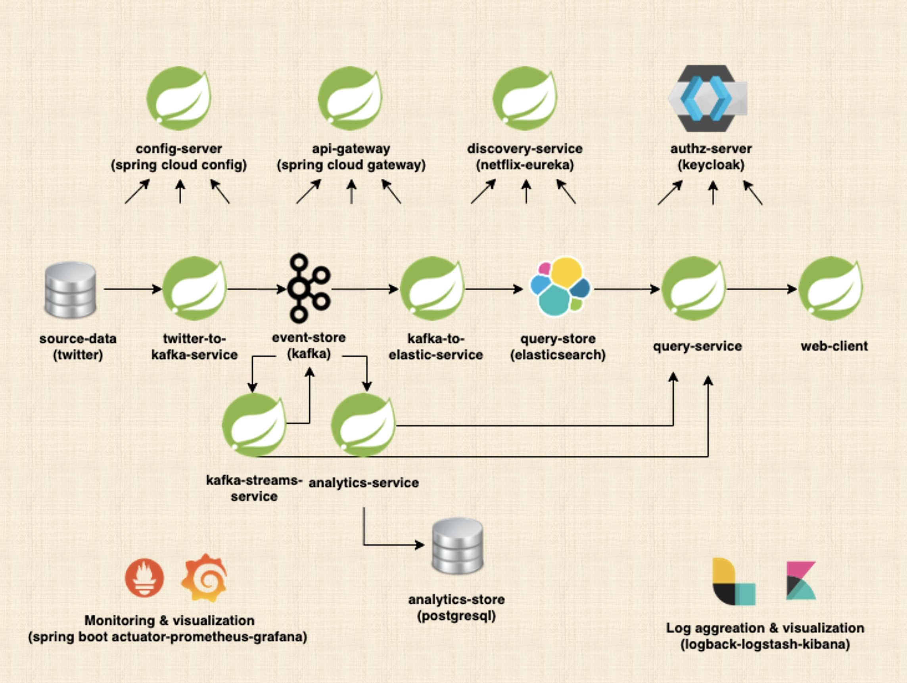

# event-driven-microservices-app

Я прохожу курс
[Event-Driven Microservices: Spring Boot, Kafka and Elastic](https://www.udemy.com/course/event-driven-microservices-spring-boot-kafka-and-elasticsearch/)
на платформе Udemy.com.

Курс посвящён созданию приложения, в котором будут взаимодействовать между собой несколько микросервисов 
под управлением Spring Cloud, с использованием паттернов Event Sourcing и Event Driven.



С большинством технологий, которые будут применяться в проекте, я так или иначе знакома. Новыми для меня станут 
Keycloak, Kafka Streams, ELK-stack.

## technologies

Курс неактуальный, 2020 года (судя по версии Spring Boot 2.3.4). Прохожу я его летом 2025 года. Писать буду
на Java 17 и Spring Boot 3.5.0, меняя библиотеки и технологии на ходу. Поэтому готовлюсь много гуглить,
особенно по работе со Spring Cloud (там чуть ли не все компоненты кардинально поменялись) :smile:.

Решила вести таблицу, какие более новые технологии я использовала.

| Что было в курсе | Что я использовала |
|:-:|:-:|
| Java 11 | Java 17 |
| Spring Boot 2.3.4 | Spring Boot 3.5.0 |
| Spring Cloud 2.2.6.RELEASE | Spring Cloud 4.3.0 |
| Logback | Log4j2 |
| Apache Httpclient | Apache Httpclient5 |
| Apache Kafka + Zookeeper | Apache Kafka KRaft mode |

## twitter-to-kafka-service

Микросервис предназначен для получения потока твитов из социальной сети X (ex-Twitter) по заданным ключевым
словам.

Поработать с настоящим потоком твитов мне так и не удалось. Я зарегистрировала аккаунт разработчика в 
X, но, как оказалось, с 2023 года на бесплатном аккаунте получение стриммингового потока 
недоступно. Ни с помощью библиотеки `twitter4j-stream`, ни с помощью класса `TwitterV2StreamHelper`, 
написанного мною по аналогии с репозиторием `Twitter V2 API` от самих разработчиков Twitter :angry: 
Единственное, что мне удалось получить, это десяток твитов через одноразовый REST-запрос в Postman. 
Минимальный базовый тарифный план, на котором доступен стримминговый поток твитов, стоит 175-200$/месяц.

Тем не менее, классы и конфигурации я сохранила:

- класс `TwitterKafkaStreamRunner` работает на основе библиотеки `twitter4j-stream`. Для организации 
стримминга твитов следует поместить в папку resources конфигурационный файл `twitter4j.properties`. 
Ключи и токены нужно сгенерировать в аккаунте разработчика. Пример файла:

```properties
debug=true
oauth.consumerKey=*********************
oauth.consumerSecret=******************************************
oauth.accessToken=**************************************************
oauth.accessTokenSecret=******************************************
```

- класс `TwitterV2KafkaStreamRunner` работает на основе класса `TwitterV2StreamHelper`. В этом случае
для организации стримминга твитов не нужен отдельный файл конфигурации, достаточно настроек в
`application.yaml`. Но потребуется BearerToken, который также генерируется в аккаунте разработчика.

- класс `MockKafkaStreamRunner` генерирует поток псевдотвитов, собираемых из набора слов с добавлением 
одного случайно выбранного ключевого слова.
